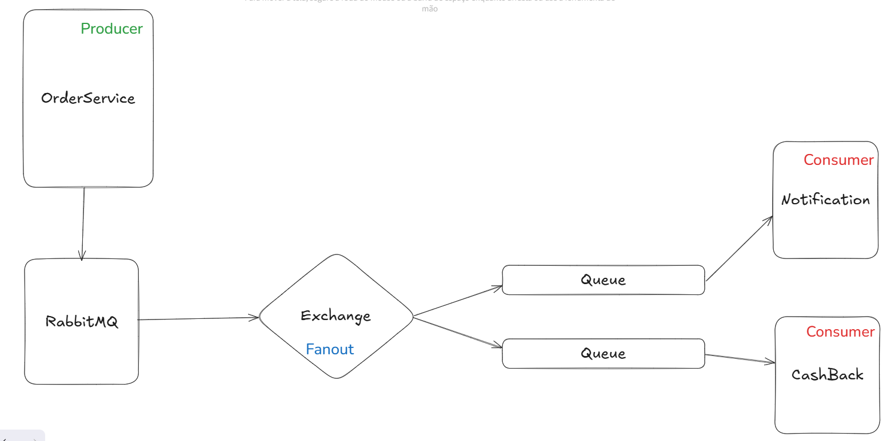

## Arquitetura implementada:

## Descrição:
Projeto desenvolvido para implementação de uma fila de mensagens utilizando o RabbitMQ. Serviços básicos como controle de concorrência, controle de transações e controle de mensagens foram implementados.
Projeto proposto para ser utilizado como template para futuras utilizações.

## Tecnologias utilizadas:
- Java 21
- Spring Boot
- RabbitMQ
- Docker